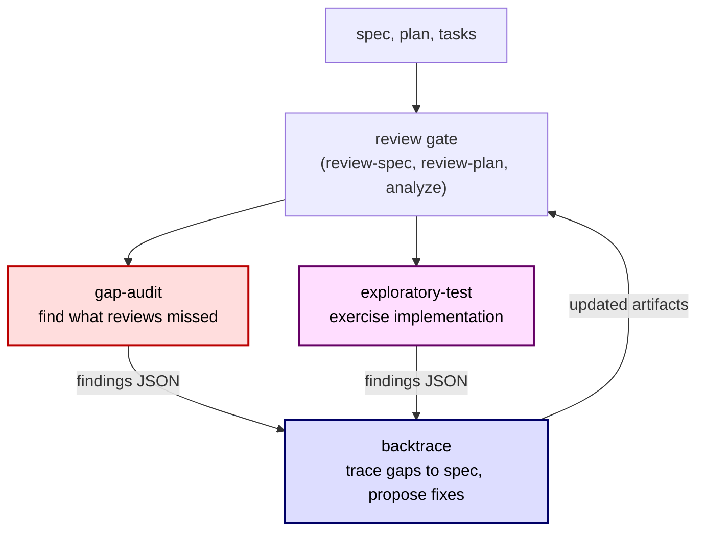

# sdd-skills

Custom extensions for [speckit](https://github.com/github/spec-kit), a CLI framework for Specification-Driven Development (SDD) with AI agent workflows.

## Prerequisites

- [speckit](https://github.com/github/spec-kit) (>= 0.5.2) initialized with [spex](https://github.com/github/spec-kit#spex) extensions (spex, spex-gates, git)
- [Claude Code](https://claude.ai/claude-code) CLI

## Where These Extensions Fit

These extensions plug into the [spex workflow](https://github.com/rhuss/cc-spex#the-workflow) as quality loops after the automatic review gates.



1. Write your spec, plan, and tasks. Review gates run automatically.
2. Run **gap-audit** to find gaps the standard reviews missed (orphan FRs, weak ACs, implicit assumptions, missing edge cases).
3. Run **backtrace** to trace each gap back to the spec item that should have caught it, propose additions with adversarial auditor approval, and apply approved changes.
4. After implementation, run **exploratory-test** to exercise the implementation beyond its success criteria and find edge cases the spec missed.
5. Run **backtrace** on exploratory findings to trace gaps back to the spec.
6. Review gates re-run on the updated artifacts. Repeat until clean.

## Extensions

This repo provides three extensions:

| Extension | Description | Command |
|-----------|-------------|---------|
| **gap-audit** | Adversarial gap auditor for specs and plans | `/speckit.gap-audit.audit` |
| **backtrace** | Trace findings back to spec gaps and propose additions | `/speckit.backtrace.trace` |
| **exploratory-test** | Adversarial tester that exercises implementations beyond success criteria | `/speckit.exploratory-test.test` |

### Installation

```bash
# Install all extensions from a local clone
specify extension add /path/to/sdd-skills/.specify/extensions/gap-audit
specify extension add /path/to/sdd-skills/.specify/extensions/backtrace
specify extension add /path/to/sdd-skills/.specify/extensions/exploratory-test
```

## Gap Audit

Dispatches an adversarial subagent to find gaps the standard review missed.

```bash
# Audit a spec for orphan FRs, weak ACs, unverifiable SCs, implicit assumptions, etc.
/speckit.gap-audit.audit spec

# Audit plan + tasks for missing contract tests, integration gaps, edge case coverage
/speckit.gap-audit.audit plan

# Save findings to JSON (consumed by backtrace)
/speckit.gap-audit.audit spec --output
```

The auditor applies 8 false positive filters and groups findings as blocking or non-blocking. See `.specify/extensions/gap-audit/README.md` for details.

## Exploratory Test

Dispatches an adversarial subagent to exercise a feature beyond its success criteria, writing and running tests to find edge cases and bugs the spec missed.

```bash
# Run exploratory tests against an implementation
/speckit.exploratory-test.test specs/004-feature/

# Specify a base branch for changed file discovery
/speckit.exploratory-test.test specs/004-feature/ --base develop

# Save findings to JSON (consumed by backtrace)
/speckit.exploratory-test.test specs/004-feature/ --output
```

The tester applies 7 test vector categories (boundary value analysis, type edges, invariant violations, feature interaction, negative testing, mock fidelity, regression) with a self-check gate. See `.specify/extensions/exploratory-test/README.md` for details.

## Backtrace

Closes the loop between finding gaps and fixing them. Traces findings back to the spec artifacts that should have caught them, proposes additions, gets adversarial auditor approval, and applies approved changes.

```bash
# Trace gap-audit findings back to spec gaps
/speckit.gap-audit.audit spec --output
/speckit.backtrace.trace spec

# Trace exploratory test findings back to spec gaps
/speckit.exploratory-test.test specs/004-feature/ --output
/speckit.backtrace.trace spec

# Plan-scope (traces against spec + plan + tasks)
/speckit.gap-audit.audit plan --output
/speckit.backtrace.trace plan
```

After applying additions, backtrace invokes follow-up reviews (review-spec, review-plan, analyze) automatically. See `.specify/extensions/backtrace/README.md` for details.

## Project Structure

```
sdd-skills/
├── .specify/
│   ├── extensions/
│   │   ├── backtrace/          # Backtrace extension
│   │   ├── exploratory-test/   # Exploratory test extension
│   │   └── gap-audit/          # Gap audit extension
│   └── memory/
│       └── constitution.md  # Synced from specs/constitution.md
├── specs/
│   ├── constitution.md      # Project governance principles
│   ├── gap-patterns.md      # Recurring gap audit patterns
│   ├── 001-gap-audit-extension/
│   ├── 002-backtrace-extension/
│   ├── 003-backtrace-improvements/
│   └── 004-exploratory-test-extension/
└── brainstorm/              # Brainstorm session documents
```

## Constitution

The project follows 8 core principles defined in `specs/constitution.md`:

1. **Correctness of Findings.** Precision over recall.
2. **Evidence-Based Claims.** Every finding cites specific evidence.
3. **Speckit-Native.** Follow speckit conventions.
4. **One Code Path Per Operation.** Call existing speckit commands.
5. **Precise Skill Instructions.** Imperative directives with explicit output formats.
6. **Architectural Decisions Require Explicit Approval.** Present options with trade-offs first.
7. **Flag Uncertainty.** Distinguish certain from uncertain claims.
8. **Conventional Commits.** All commits follow [Conventional Commits v1.0.0](https://www.conventionalcommits.org/).

## Contributing

Feature branches use sequential numbering: `001-feature-name`, `002-another-feature`. Commits follow [Conventional Commits](https://www.conventionalcommits.org/), signed and GPG-signed.

### Adding a New Extension

After implementing the extension command file, README, and extension.yml under `.specify/extensions/<name>/`, complete these additional steps before the feature is shippable.

**1. Generate SKILL.md wrapper**

Claude Code discovers slash commands via `.claude/skills/<command-name>/SKILL.md`. The `.claude/skills/` directory is gitignored, so you must `git add -f` when committing.

Two patterns exist. Use the **indirection pattern** (preferred for large command files) or the **inline pattern** (used by backtrace and exploratory-test):

*Indirection pattern* (gap-audit uses this). A short wrapper that tells Claude Code to read and follow the extension command file:

```markdown
---
name: speckit-<ext>-<verb>
description: <description>
compatibility: Requires spec-kit project structure with .specify/ directory
metadata:
  author: github-spec-kit
  source: <ext>:commands/speckit.<ext>.<verb>.md
---

# <Title>

## Overview
<Brief description>

## Execution
1. Read `.specify/extensions/<ext>/commands/speckit.<ext>.<verb>.md`
2. Follow the instructions in the command file exactly
3. Pass through any arguments provided by the user via `$ARGUMENTS`
```

*Inline pattern* (backtrace and exploratory-test use this). The full command file body with skill frontmatter prepended:

```bash
mkdir -p .claude/skills/speckit-<ext>-<verb>
# Write frontmatter, then append command file body (strip YAML frontmatter):
sed '1,/^---$/d' .specify/extensions/<name>/commands/speckit.<ext>.<verb>.md \
  >> .claude/skills/speckit-<ext>-<verb>/SKILL.md
# Stage the gitignored file:
git add -f .claude/skills/speckit-<ext>-<verb>/SKILL.md
```

Pick one pattern and be consistent within the extension. Either pattern works. Indirection avoids SKILL.md drift but adds one read hop. Inline eliminates the hop but requires regeneration on every command file edit.

**2. Update backtrace schema awareness** (if the extension produces findings)

If the extension writes a `.*-findings.json` file, update the backtrace command file's Section 4 (Findings Resolution, around line 104) to detect the new `source` value and normalize to GapFinding shape. See the existing `"exploratory"` mapping as a reference for the normalization table format. GapFinding fields: `classification`, `category`, `description`, `evidence`, `suggested_fix`. Then regenerate the backtrace SKILL.md wrapper (step 5).

**3. Update project README**

- Add to the Extensions table
- Add to the workflow diagram (Mermaid)
- Add usage section with examples
- Add to the project structure tree (verify the tree is current first)
- Add to the installation instructions
- Use dot notation for command names (e.g., `/speckit.ext.verb`, not `/speckit-ext-verb`)

**4. Set extension license**

Our extensions use `license: Apache-2.0` in extension.yml. Do not modify upstream speckit extension licenses (spex, spex-gates, spex-deep-review, spex-teams, spex-worktrees, git). Those are MIT and not ours to change.

**5. Regenerate SKILL.md wrappers for any edited extensions**

If you edited another extension's command file (e.g., backtrace for schema awareness), regenerate its SKILL.md wrapper using the same process as step 1. Remember to `git add -f` the regenerated file.

### Branch Cleanup Before Merge

Squash the feature branch into exactly 3 commits:

1. `docs(<scope>)`: All spec artifacts (spec.md, plan.md, tasks.md, research.md, data-model.md, contracts/, checklists/, REVIEW-*.md, review-findings.md)
2. `feat(<scope>)`: All implementation files (extension.yml, command files, README, SKILL.md wrappers)
3. `docs` or `chore`: Project README updates, CLAUDE.md changes, config changes

Fast-forward merge to main. After merge:
- Clear `CLAUDE.md` plan pointer: the line is inside `<!-- SPECKIT START/END -->` markers. Edit CLAUDE.md directly to remove the "Current plan:" line. Speckit will not overwrite it unless you re-run `specify init`.
- Delete the feature branch: `git branch -d <branch-name>`
- Clear `.specify/feature.json`: write `{}` to reset it
- Delete `.specify/.spex-state` if it exists (stale flow state)
- Delete `.specify/.sdd-phase` if it exists (stale drive state)

## License

Apache 2.0. See [LICENSE](LICENSE).
