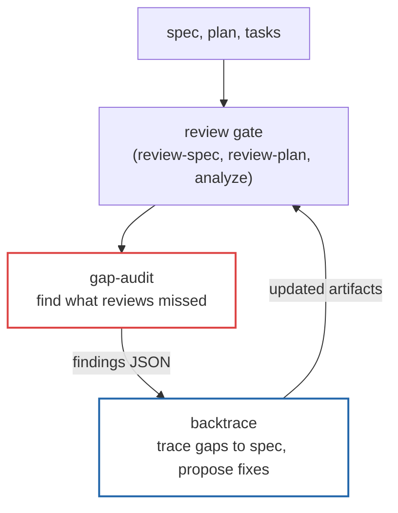

# sdd-skills

Custom extensions for [speckit](https://github.com/github/spec-kit), a CLI framework for Specification-Driven Development (SDD) with AI agent workflows.

## Prerequisites

- [speckit](https://github.com/github/spec-kit) (>= 0.5.2) initialized with [spex](https://github.com/github/spec-kit#spex) extensions (spex, spex-gates, git)
- [Claude Code](https://claude.ai/claude-code) CLI

## Where These Extensions Fit

These extensions plug into the [spex workflow](https://github.com/rhuss/cc-spex#the-workflow) as quality loops after the automatic review gates.



1. Write your spec, plan, and tasks. Review gates run automatically.
2. Run **gap-audit** to find gaps the standard reviews missed (orphan FRs, weak ACs, implicit assumptions, missing edge cases).
3. Run **backtrace** to trace each gap back to the spec item that should have caught it, propose additions with adversarial auditor approval, and apply approved changes.
4. Review gates re-run on the updated artifacts. Repeat until clean.

## Extensions

This repo provides two extensions:

| Extension | Description | Command |
|-----------|-------------|---------|
| **gap-audit** | Adversarial gap auditor for specs and plans | `/speckit-gap-audit-audit` |
| **backtrace** | Trace gap-audit findings back to spec gaps and propose additions | `/speckit-backtrace-trace` |

### Installation

```bash
# Install both extensions from a local clone
specify extension add /path/to/sdd-skills/.specify/extensions/gap-audit
specify extension add /path/to/sdd-skills/.specify/extensions/backtrace
```

## Gap Audit

Dispatches an adversarial subagent to find gaps the standard review missed.

```bash
# Audit a spec for orphan FRs, weak ACs, unverifiable SCs, implicit assumptions, etc.
/speckit-gap-audit-audit spec

# Audit plan + tasks for missing contract tests, integration gaps, edge case coverage
/speckit-gap-audit-audit plan

# Save findings to JSON (consumed by backtrace)
/speckit-gap-audit-audit spec --output
```

The auditor applies 8 false positive filters and groups findings as blocking or non-blocking. See `.specify/extensions/gap-audit/README.md` for details.

## Backtrace

Closes the loop between finding gaps and fixing them. Traces gap-audit findings back to the spec artifacts that should have caught them, proposes additions, gets adversarial auditor approval, and applies approved changes.

```bash
# Run gap-audit with --output first to persist findings
/speckit-gap-audit-audit spec --output

# Then run backtrace to trace and fix the gaps
/speckit-backtrace-trace spec

# Plan-scope (traces against spec + plan + tasks)
/speckit-gap-audit-audit plan --output
/speckit-backtrace-trace plan
```

After applying additions, backtrace invokes follow-up reviews (review-spec, review-plan, analyze) automatically. See `.specify/extensions/backtrace/README.md` for details.

## Project Structure

```
sdd-skills/
├── .specify/
│   ├── extensions/
│   │   ├── backtrace/       # Backtrace extension
│   │   └── gap-audit/       # Gap audit extension
│   └── memory/
│       └── constitution.md  # Synced from specs/constitution.md
├── specs/
│   ├── constitution.md      # Project governance principles
│   ├── gap-patterns.md      # Recurring gap audit patterns
│   ├── 001-gap-audit-extension/
│   └── 002-backtrace-extension/
└── brainstorm/              # Brainstorm session documents
```

## Constitution

The project follows 8 core principles defined in `specs/constitution.md`:

1. **Correctness of Findings.** Precision over recall.
2. **Evidence-Based Claims.** Every finding cites specific evidence.
3. **Speckit-Native.** Follow speckit conventions.
4. **One Code Path Per Operation.** Call existing speckit commands.
5. **Precise Skill Instructions.** Imperative directives with explicit output formats.
6. **Architectural Decisions Require Explicit Approval.** Present options with trade-offs first.
7. **Flag Uncertainty.** Distinguish certain from uncertain claims.
8. **Conventional Commits.** All commits follow [Conventional Commits v1.0.0](https://www.conventionalcommits.org/).

## Contributing

Feature branches use sequential numbering: `001-feature-name`, `002-another-feature`. Commits follow [Conventional Commits](https://www.conventionalcommits.org/), signed and GPG-signed.

## License

Apache 2.0. See [LICENSE](LICENSE).
